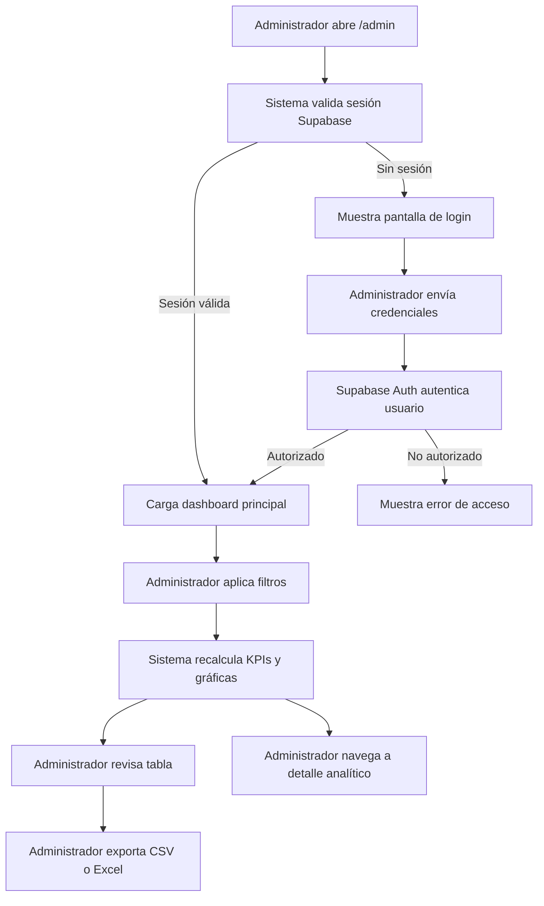

## 1. Resumen del Producto

Dashboard administrativo para la campaña interactiva de Dunkin' Colombia, enfocado en analítica de participación, conversión y rendimiento comercial del quiz.

- Resuelve la necesidad de monitorear sesiones, resultados, formularios, abandono y clics finales desde una sola interfaz interna.
- Su valor principal es convertir datos operativos del quiz en decisiones rápidas de marketing, performance y optimización UX.

## 2. Funcionalidades Principales

### 2.1 Roles de Usuario

| Rol           | Método de acceso        | Permisos principales                                                     |
| ------------- | ----------------------- | ------------------------------------------------------------------------ |
| Administrador | Login con Supabase Auth | Acceso completo al dashboard, filtros, exportaciones y vistas analíticas |

### 2.2 Módulos Funcionales

1. **Login administrativo**: autenticación segura con Supabase, validación de sesión y control de acceso.
2. **Dashboard principal**: KPIs, gráficas, filtros globales, tabla de participantes y exportación.
3. **Vista de detalle analítico**: bloques profundos por comportamiento, embudo y abandono.

### 2.3 Detalle de Páginas

| Página            | Módulo                   | Descripción funcional                                                                                                      |
| ----------------- | ------------------------ | -------------------------------------------------------------------------------------------------------------------------- |
| Login             | Formulario de acceso     | Permite autenticación por correo y contraseña con sesión persistente para administradores                                  |
| Dashboard         | KPIs superiores          | Muestra participantes totales, tests completados, formularios enviados, conversión, tiempo promedio, abandono, clics y CTR |
| Dashboard         | Filtros globales         | Filtra por rango de fechas, bebida, personalidad, dispositivo y fuente de tráfico                                          |
| Dashboard         | Visualizaciones          | Renderiza gráficas por bebida, personalidad, día, hora, dispositivo, navegador, fuente y abandono por pregunta             |
| Dashboard         | Tabla operativa          | Lista participantes y sesiones con nombre, correo, celular, resultado, bebida, fecha, duración, dispositivo y estado       |
| Dashboard         | Exportaciones            | Descarga CSV y Excel aplicando los filtros activos                                                                         |
| Dashboard         | Estados vacíos y errores | Informa ausencia de datos, errores de carga y problemas de permisos                                                        |
| Detalle analítico | Embudo del quiz          | Desglosa inicio, respuesta, finalización, formulario y clic final                                                          |
| Detalle analítico | Rendimiento comercial    | Identifica bebida más obtenida, bebida con más clics y mejores fuentes de tráfico                                          |

## 3. Flujo Principal

El administrador inicia sesión con credenciales autorizadas en Supabase Auth. Una vez autenticado, accede a un dashboard desktop-first con KPIs superiores, filtros persistentes y módulos analíticos conectados a Supabase. Desde la misma interfaz puede segmentar datos, revisar participantes, detectar abandono por pregunta y exportar resultados para análisis externo.

## 4. Diseño de Interfaz

### 4.1 Estilo Visual

- Dirección estética: editorial premium con precisión analítica, inspirada en Stripe, Vercel, Supabase Studio y Linear.
- Fondo: base clara cálida con planos crema y superficies blancas translúcidas, acentos Dunkin intensos y sombras suaves de profundidad.
- Colores principales: `#F8F4F1`, `#FFFFFF`, `#FF0068`, `#EF6A00`, `#3E342F`, `#FFE8D6`.
- Botones: cápsula refinada, fondo naranja Dunkin `#EF6A00`, texto crema `#F8F4F1`, estados hover con glow controlado.
- Tipografía: `DunkinSans-ExtraBold` para títulos destacados y `DunkinSans-Medium` para cuerpo, métricas, labels y tabla.
- Layout: desktop-first con navegación lateral compacta, franja superior de contexto y módulos analíticos en grilla editorial.
- Iconografía: Lucide React, trazo fino, integración sobria con badges y contenedores utilitarios.
- Movimiento: Framer Motion con entradas cortas, microtransiciones de filtros, shimmer en loading y cambios suaves de estado.

### 4.2 Resumen por Página

| Página            | Módulo            | Elementos UI                                                                             |
| ----------------- | ----------------- | ---------------------------------------------------------------------------------------- |
| Login             | Panel de acceso   | Card centrada, branding Dunkin, inputs limpios, CTA cápsula y feedback de error elegante |
| Dashboard         | Header analítico  | Título editorial, badge de entorno, timestamp de actualización y acciones de exportación |
| Dashboard         | KPIs              | Cards métricas con variación visual sutil, mini tendencia y foco alto en legibilidad     |
| Dashboard         | Gráficas          | Tarjetas modulares con títulos compactos, leyendas limpias y colorimetría consistente    |
| Dashboard         | Filtros           | Selects y date pickers compactos, barra sticky en desktop y estado activo visible        |
| Dashboard         | Tabla             | Tabla de densidad media, columnas legibles, badges de estado y filas con hover suave     |
| Detalle analítico | Embudo y abandono | Bloques comparativos, barras horizontales, ranking de preguntas y lectura ejecutiva      |

### 4.3 Responsividad

- Estrategia: desktop-first, con experiencia principal optimizada para pantallas anchas y mesas de trabajo administrativas.
- Breakpoints: `lg` como referencia mínima de experiencia completa; `md` solo adapta visualmente, no redefine la jerarquía.
- En pantallas menores, el layout puede colapsar a una versión resumida, pero el objetivo inicial del producto es escritorio.
