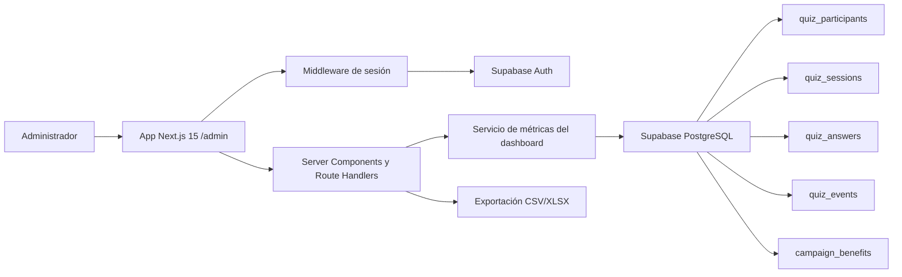
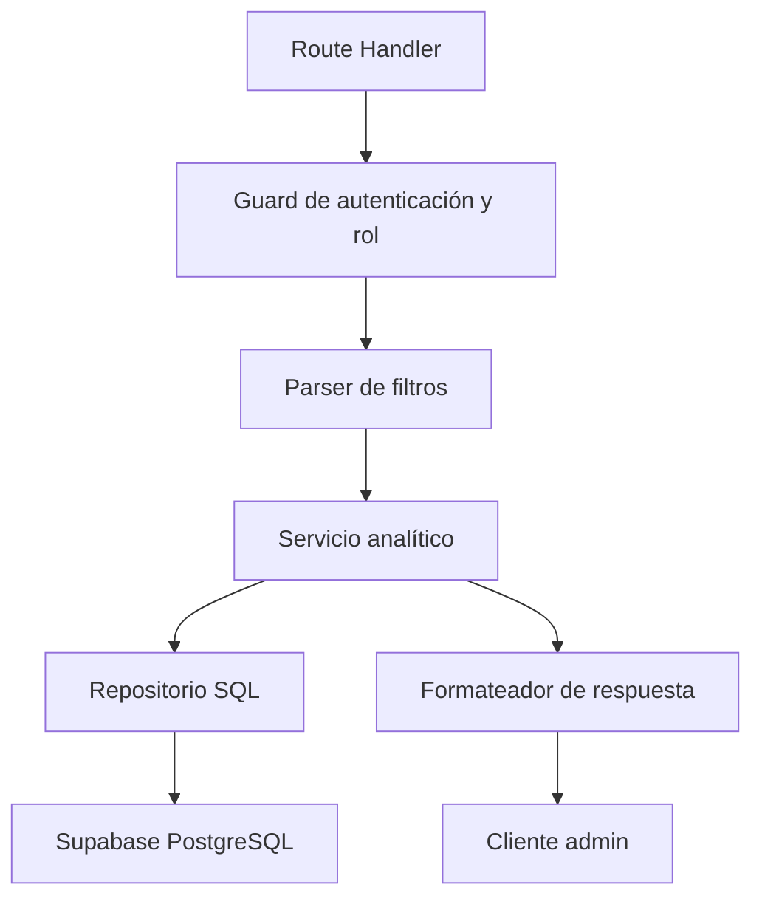
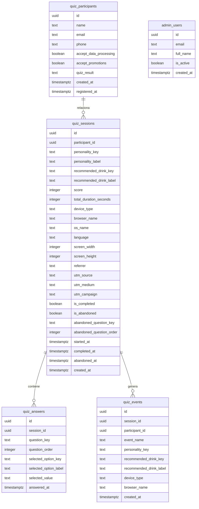

## 1. Diseño de Arquitectura



## 2. Descripción Tecnológica

- Frontend: `Next.js 15` + `React 19` + `TypeScript` + `TailwindCSS` + `Framer Motion` + `Lucide React`
- Estado de UI: `Zustand` para controles locales del dashboard si se requiere persistencia de filtros en cliente
- Formularios: `React Hook Form` para login y filtros avanzados
- Autenticación: `Supabase Auth`
- Datos: `Supabase PostgreSQL`
- Exportación: generación server-side de `CSV` y `XLSX`
- Visualización: componentes propios con `SVG`, `CSS` y utilidades internas; sin dependencia obligatoria de librerías pesadas de charts

## 3. Definición de Rutas

| Ruta                                | Propósito                                            |
| ----------------------------------- | ---------------------------------------------------- |
| `/admin`                            | Dashboard principal protegido para administradores   |
| `/admin/login`                      | Pantalla de autenticación administrativa             |
| `/admin/analytics`                  | Vista extendida de comportamiento, embudo y abandono |
| `/api/admin/dashboard/summary`      | Devuelve KPIs y resumen superior según filtros       |
| `/api/admin/dashboard/charts`       | Devuelve datasets agregados para gráficas            |
| `/api/admin/dashboard/participants` | Devuelve tabla paginada de participantes y sesiones  |
| `/api/admin/dashboard/export/csv`   | Exporta dataset filtrado en CSV                      |
| `/api/admin/dashboard/export/xlsx`  | Exporta dataset filtrado en Excel                    |

## 4. Definición de APIs

### 4.1 Tipos principales

```ts
export interface DashboardFilters {
  startDate?: string;
  endDate?: string;
  drinkKey?: string;
  personalityKey?: string;
  deviceType?: "mobile" | "tablet" | "desktop";
  trafficSource?: string;
}

export interface DashboardSummaryResponse {
  totalParticipants: number;
  completedTests: number;
  submittedForms: number;
  conversionRate: number;
  averageDurationSeconds: number | null;
  abandonmentRate: number;
  viewInDunkinClicks: number;
  viewInDunkinCtr: number;
  topClickedDrink: {
    drinkKey: string | null;
    drinkLabel: string | null;
    clicks: number;
  };
}

export interface DashboardParticipantRow {
  participantId: string | null;
  fullName: string | null;
  email: string | null;
  phone: string | null;
  personalityKey: string | null;
  personalityLabel: string | null;
  recommendedDrinkKey: string | null;
  recommendedDrinkLabel: string | null;
  completedAt: string | null;
  totalDurationSeconds: number | null;
  deviceType: string | null;
  status: "completed" | "abandoned" | "started";
}
```

### 4.2 Contratos de endpoints

| Endpoint                            | Método | Descripción                              |
| ----------------------------------- | ------ | ---------------------------------------- |
| `/api/admin/dashboard/summary`      | `GET`  | KPIs agregados del encabezado            |
| `/api/admin/dashboard/charts`       | `GET`  | Series agrupadas para todas las gráficas |
| `/api/admin/dashboard/participants` | `GET`  | Tabla paginada y filtrable               |
| `/api/admin/dashboard/export/csv`   | `GET`  | Descarga CSV de la vista filtrada        |
| `/api/admin/dashboard/export/xlsx`  | `GET`  | Descarga Excel de la vista filtrada      |

### 4.3 Reglas de acceso

- Todas las rutas `/admin/**` requieren sesión válida.
- Todas las rutas `/api/admin/**` validan usuario autenticado y rol administrativo.
- El rol administrativo se resuelve con una tabla `admin_users` o por lista autorizada de correos en Supabase, según disponibilidad del proyecto.
- Recomendación inicial: usar tabla `admin_users` para que el control quede auditable y no dependa de código hardcodeado.

## 5. Arquitectura del Servidor



## 6. Modelo de Datos

### 6.1 Definición del Modelo



### 6.2 Lenguaje de Definición de Datos

```sql
create table if not exists public.admin_users (
  id uuid primary key default gen_random_uuid(),
  email text not null unique,
  full_name text,
  is_active boolean not null default true,
  created_at timestamptz not null default timezone('utc', now())
);

create index if not exists idx_admin_users_email on public.admin_users(email);

alter table public.admin_users enable row level security;

create policy "admin_users_select_self"
on public.admin_users
for select
to authenticated
using (email = auth.jwt() ->> 'email');
```

## 7. Estrategia de Consultas

- **KPIs**: consultas agregadas sobre `quiz_sessions`, `quiz_events` y `quiz_participants`.
- **CTR del botón**: `view_in_dunkin_clicks / tests_completed`.
- **Bebida con más clics**: agregación de `quiz_events` filtrando `event_name = 'view_in_dunkin_clicked'`.
- **Abandono por pregunta**: agregación de `quiz_sessions` por `abandoned_question_key`.
- **Tabla operativa**: `left join` entre `quiz_sessions` y `quiz_participants`, con paginación server-side.
- **Fuentes de tráfico**: agrupación combinando `utm_source`, `utm_medium` y `utm_campaign`.

## 8. Estrategia de Implementación

1. Crear `admin_users` y seed inicial de administradores.
2. Implementar login con Supabase Auth y guard de acceso.
3. Construir layout base del dashboard con navegación lateral y header superior.
4. Implementar endpoints agregados para summary, charts y tabla.
5. Construir módulo de exportación CSV y XLSX en backend.
6. Añadir estados de carga, vacío, error y skeletons.
7. Validar performance con filtros server-side y paginación.

## 9. Riesgos y Decisiones

- Evitar consultas pesadas en cliente; todo el cálculo debe salir del servidor.
- No exponer tablas analíticas directamente al navegador sin control de rol.
- Mantener el dashboard desacoplado del frontend público del quiz.
- Si el volumen crece, se puede evolucionar a vistas materializadas para KPIs y gráficas, sin rehacer la UI.
