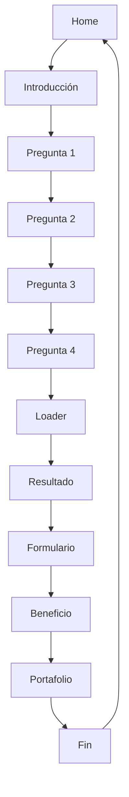

# User Flow - Dunkin Colombia Campaign

**"Dime qué tomas y te diré quién eres"**

---

## 🏠 Home

### Objetivo
Presentar la campaña y generar curiosidad para que el usuario inicie el quiz.

### Emoción
Anticipación, diversión y curiosidad.

### Acción principal
Botón de **"¡Iniciar el Quiz!"** (CTA de alto contraste).

### Tiempo estimado
3-10 segundos.

### Qué debe sentir el usuario
"¡Me gusta Dunkin'! Me interesa descubrir qué dice mi bebida favorita sobre mí."

### Buenas prácticas UX
- **Mobile First**: Diseño adaptado a móvil primero.
- **Foco en la hero**: Imagen impactante grande del producto Dunkin'.
- **Contraste alto**: Título destacado y CTA visible sin scroll.
- **Social Proof**: Testimonios o cantidad de participantes (si aplica).
- **Sencillez**: Una sola acción principal.

### Microinteracciones
- **Hero image**: Efecto de parallax suave al hacer scroll.
- **Botón CTA**: Escala al 102% al hacer hover, se encoge a 98% al hacer clic.
- **Iconos animados**: ícono de café que baila suavemente.
- **Scroll hint**: Indicador de scroll con animación de rebote.

---

## 📝 Introducción

### Objetivo
Explicar brevemente cómo funciona el quiz y generar entusiasmo.

### Emoción
Engagement y preparación.

### Acción principal
Botón de **"¡Empecemos!"**.

### Tiempo estimado
10-20 segundos.

### Qué debe sentir el usuario
"¡Esto es sencillo y divertido! Quiero ver qué soy."

### Buenas prácticas UX
- **Pocos pasos**: 3-4 puntos claros.
- **Visuales grandes**: Ilustraciones o íconos para cada paso.
- **Tono amigable**: Lenguaje cercano y divertido, como hablar con un amigo.
- **No jargon**: No usar términos complicados.

### Microinteracciones
- **Paso a paso**: Cada punto aparece con animación de slide-in.
- **Checkmarks virtuales**: Efecto de "completado" a medida que el usuario lee.
- **Botón con confetti**: Animación de confeti pequeño al hacer clic en "¡Empecemos!".
- **Progreso visual**: Barra de progreso inicial que se llena.

---

## 🤔 Pregunta 1 - Pregunta 4

*(Mismo patrón para todas las preguntas)*

### Objetivo
Capturar la preferencia del usuario de forma divertida.

### Emoción
Decisión fácil y disfrute.

### Acción principal
Seleccionar una opción y hacer clic en **"Siguiente"**.

### Tiempo estimado
8-15 segundos por pregunta.

### Qué debe sentir el usuario
"¡Esta pregunta es genial! Me identifico con esta opción."

### Buenas prácticas UX
- **Opciones visuales**: Cards grandes con íconos/emojis representativos.
- **Feedback inmediato**: Resaltado visual de la opción seleccionada.
- **Progreso claro**: Barra de progreso en la parte superior.
- **No carga cognitiva**: Máximo 4 opciones por pantalla.
- **Mobile friendly**: Botones grandes y fáciles de tocar.

### Microinteracciones
- **Cambio de página**: Animación de slide suave entre preguntas.
- **Selección de opción**: La tarjeta se eleva ligeramente y se resalta con un borde.
- **Progreso animado**: La barra de progreso se llena con efecto de transición.
- **Botón "Siguiente"**: Se activa solo cuando hay una opción seleccionada.
- **Sonido táctil**: Opcional - sonido suave al seleccionar (solo en web).

---

## ⏳ Loader

### Objetivo
Dar feedback al usuario mientras se calcula el resultado.

### Emoción
Anticipación y expectativa.

### Acción principal
Ninguna, solo esperar.

### Tiempo estimado
1-3 segundos.

### Qué debe sentir el usuario
"¡No puedo esperar a ver mi resultado!"

### Buenas prácticas UX
- **Feedback visual claro**: Loader que representa la identidad de Dunkin' (café, donas).
- **Mensaje de espera**: Frase divertida como "Preparando tu café personalidad...".
- **Transición suave**: Conecta fluidamente con la pantalla de resultado.
- **No más de 3 segundos**: Si el cálculo es más rápido, mostrar el loader mínimo.

### Microinteracciones
- **Loader animado**: Café que se llena o donas que rotan suavemente.
- **Efecto de pulso**: El ícono principal del loader tiene un efecto de respiración.
- **Mensajes cambiantes**: 2-3 frases diferentes que aparecen suavemente.
- **Fade-out gradual**: Transición suave hacia la pantalla de resultado.

---

## 🎉 Resultado

### Objetivo
Mostrar el resultado final de forma memorable y compartible.

### Emoción
Sorpresa y satisfacción.

### Acción principal
**"Compartir mi Resultado"** y **"Continuar"**.

### Tiempo estimado
15-40 segundos.

### Qué debe sentir el usuario
"¡Me encanta mi resultado! Quiero compartirlo con mis amigos."

### Buenas prácticas UX
- **Resultado destacado**: Título grande y colorido.
- **Descripción detallada**: 2-3 frases que expliquen la personalidad.
- **Bebida asociada**: Imagen grande y atractiva de la bebida Dunkin'.
- **CTAs claros**: Botones bien diferenciados para compartir y continuar.
- **Share-friendly**: Diseño optimizado para compartir en redes sociales.

### Microinteracciones
- **Aparición del resultado**: Efecto de "explosión" suave con partículas.
- **Imagen hero**: Zoom-in gradual de la bebida.
- **Botón de compartir**: Efecto de brillo al pasar el cursor.
- **Animación de confeti**: Pequeños confeti de colores Dunkin' al cargar la pantalla.
- **Efecto hover en tarjeta**: La tarjeta del resultado se eleva al pasar el cursor.

---

## 📋 Formulario

### Objetivo
Capturar datos del usuario para entregar el beneficio.

### Emoción
Transparencia y confianza.

### Acción principal
Completar el formulario y hacer clic en **"¡Obtener mi Beneficio!"**.

### Tiempo estimado
20-40 segundos.

### Qué debe sentir el usuario
"¡Esto vale la pena! Quiero recibir mi beneficio."

### Buenas prácticas UX
- **Campos mínimos**: Solo lo esencial (nombre, correo, teléfono - si es necesario).
- **Progresión de campos**: Indicador visual de cuántos campos faltan.
- **Validación en tiempo real**: Feedback inmediato de errores.
- **Transparencia**: Explicar claramente qué harán con los datos.
- **Términos y condiciones**: Checkbox con link a política.
- **Save for later**: Opcional - permitir guardar progreso.

### Microinteracciones
- **Validación instantánea**: ✓ verde cuando está correcto, ✗ rojo cuando hay error.
- **Transición entre campos**: Auto-focus al siguiente campo con animación.
- **Efecto en botón**: Se activa solo cuando todo está completo con un "pop".
- **Checkmarks animados**: Se llenan con animación a medida que el usuario completa.

---

## 🎁 Beneficio

### Objetivo
Entregar el beneficio y generar gratitud.

### Emoción
Recompensa y agradecimiento.

### Acción principal
**"Usar mi Beneficio"** y **"Ver el Menú"**.

### Tiempo estimado
10-30 segundos.

### Qué debe sentir el usuario
"¡Genial! Me encanta este beneficio. Voy a usar Dunkin' pronto."

### Buenas prácticas UX
- **Beneficio visual**: Imagen atractiva del producto o cupón.
- **Código destacado**: Código QR o código alfanumérico grande.
- **Instrucciones claras**: Pasos simples para canjear.
- **Fecha de expiración**: Destaque visual de la validez.
- **CTA a tienda**: Botón para buscar la tienda más cercana.

### Microinteracciones
- **Reveal del beneficio**: Efecto de "desenvolver regalo".
- **Código QR**: Escala al pasar el cursor.
- **Efecto de brillo**: El beneficio tiene un efecto de brillo suave.
- **Botón de "Usar"**: Pulsación con feedback táctil.

---

## 📸 Portafolio

### Objetivo
Mostrar más productos y generar fidelidad.

### Emoción
Curiosidad y deseo de probar más productos.

### Acción principal
Explorar productos y **"Ordenar Ahora"**.

### Tiempo estimado
20-60 segundos.

### Qué debe sentir el usuario
"¡Wow! Dunkin' tiene productos geniales. Quiero probarlos todos."

### Buenas prácticas UX
- **Galería atractiva**: Cards grandes con imágenes de alta calidad.
- **Filtros simples**: Por categoría (cafés, donas, bebidas frías).
- **Información clave**: Precio y descripción corta.
- **Botón de acción destacado**: Fácil de encontrar.
- **Scroll infinito o paginación simple**: Navegación fluida.

### Microinteracciones
- **Cards con hover**: Se elevan y muestran sombra más pronunciada.
- **Efecto de zoom en imágenes**: Ligeramente se agrandan al pasar el cursor.
- **Like rápido**: Botón de corazón que se llena de rojo con animación.
- **Scroll suave**: Navegación fluida entre categorías.

---

## 🏁 Fin

### Objetivo
Cerrar la experiencia de forma memorable y fomentar el regreso.

### Emoción
Satisfacción y nostalgia.

### Acción principal
**"Volver a Empezar"** y **"Visitar el Sitio"**.

### Tiempo estimado
10-20 segundos.

### Qué debe sentir el usuario
"¡Fue genial! Definitivamente volveré a Dunkin'."

### Buenas prácticas UX
- **Mensaje de agradecimiento cálido**: Frase personalizada.
- **Redes sociales**: Botones para seguir a Dunkin' Colombia.
- **CTA de regreso**: Opción clara para volver a empezar.
- **Diseño simple**: No saturar con mucha información.

### Microinteracciones
- **Logo animado**: Logo de Dunkin' con efecto de "latido del corazón".
- **Botones con hover**: Escala y cambio de color suave.
- **Mensaje que aparece**: Frase final con animación de escritura.
- **Fondo suave**: Fondo con efecto de gradiente que cambia lentamente.

---

## Flujo Completo

---

## Guías de Diseño Adicionales

### Paleta de Emociones
- **Naranja Dunkin'**: Diversión, energía, creatividad.
- **Rojo Dunkin'**: Pasión, amor por el café.
- **Café/Marrón**: Calidez, tradición.
- **Blanco/Crema**: Sencillez, elegancia.

### Consistencia Visual
- Mantener la misma tipografía y colores en todas las pantallas.
- Las microinteracciones deben tener la misma duración (200-300ms).
- Los botones deben tener siempre el mismo tamaño y espaciado.

### Accesibilidad
- Todo texto debe tener contraste suficiente (WCAG AA).
- Tamaños de fuente legibles (mínimo 16px en móvil).
- Navegación por teclado completa.
- Alternativas de texto para todas las imágenes.

---
*Documentación creada para la campaña oficial de Dunkin' Colombia - "Dime qué tomas y te diré quién eres"*
